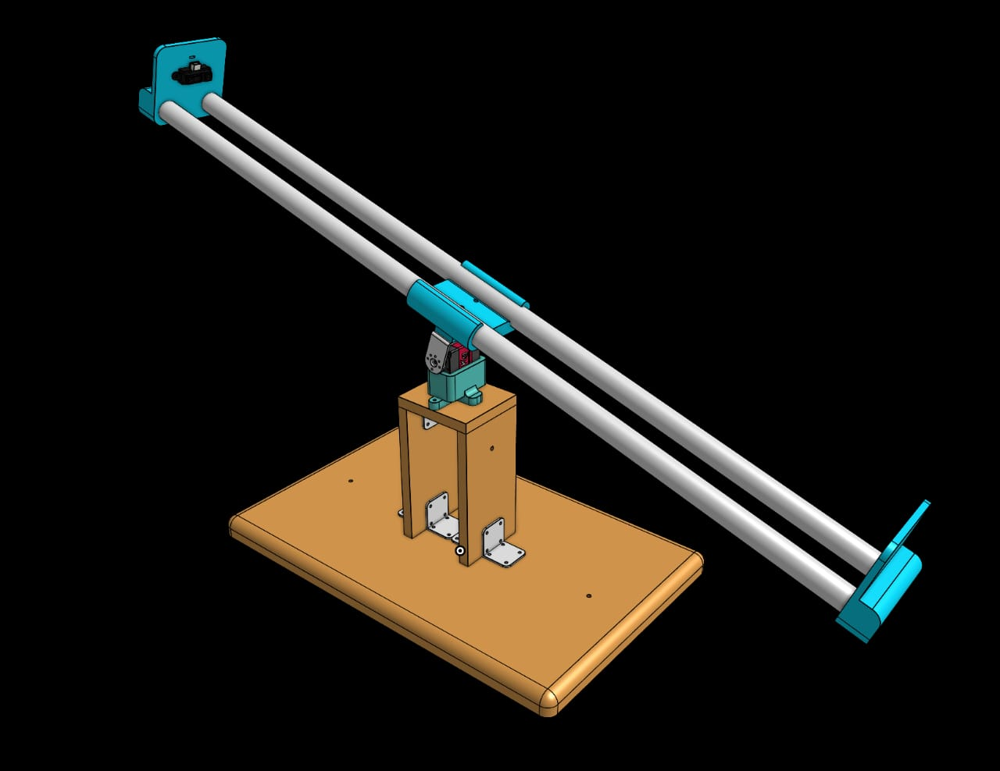
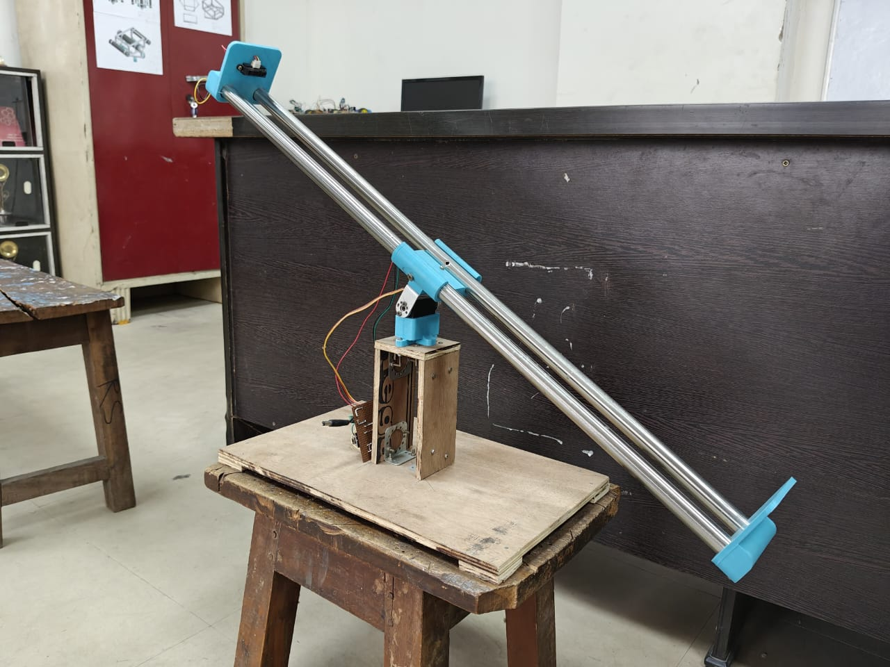
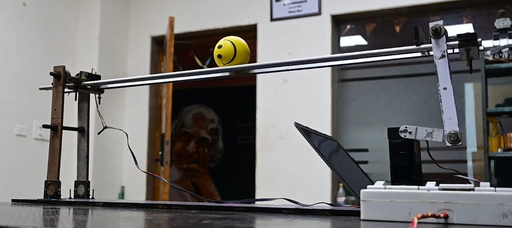

# PID Seesaw

## Overview

The PID Seesaw project demonstrates the application of a Proportional-Integral-Derivative (PID) controller to balance a seesaw (inverted pendulum) system. The objective is to maintain the ball's position by dynamically adjusting the control input based on real-time feedback from the system.

<div align="center">






</div>

## System Description

- **Plant:** The system consists of a seesaw with a ball mounted on a pivot, which is inherently unstable and requires active control to maintain balance.
- **Sensor:** A distance sensor is used to measure the distance of the ball from an extreme end of the seesaw.
- **Actuator:** A servo applies corrective torque or force to bring the ball back to the set point.
- **Controller:** The PID controller processes the error signal (difference between the desired and actual position) and computes the control action.

## PID Control Algorithm

The PID controller output is given by:

```
u(t) = Kp * e(t) + Ki * ∫e(t)dt + Kd * de(t)/dt
```

Where:
- `e(t)`: Error signal (desired position - measured position)
- `Kp`: Proportional gain (reacts to current error)
- `Ki`: Integral gain (reacts to accumulated error)
- `Kd`: Derivative gain (reacts to rate of error change)

Tuning these gains is essential for achieving a balance between responsiveness and stability.

## Implementation Steps

1. **System Modeling:** Derive and linearize the equations of motion for the seesaw.
2. **Sensor Integration:** Connect and calibrate the distance sensor for accurate feedback.
3. **Controller Design:** Implement the PID algorithm in software (e.g., Arduino, MATLAB, or Python).
4. **Tuning:** Adjust `Kp`, `Ki`, and `Kd` to minimize overshoot, settling time, and steady-state error.
5. **Testing:** Apply disturbances and observe the system's ability to return to equilibrium.
6. **Analysis:** Record and analyze the system's response to various test cases.

## Results and Discussion

- The PID controller can effectively stabilize the seesaw when properly tuned.
- The proportional term provides immediate correction, the integral term eliminates steady-state error, and the derivative term helps dampen oscillations.
- Challenges include sensor noise, actuator limitations, and non-linearities in the physical system.
- Experimental results show that the system can reject small disturbances and maintain balance, with performance depending on the quality of tuning and hardware.

## Applications

- Robotics and automation
- Educational demonstrations of feedback control
- Research in control systems and mechatronics

## References

[PID Seesaw - Report](PID%20Seesaw%20-%20Report.pdf) - A detailed report on the PID Seesaw project, including mathematical modeling, implementation details, and experimental results.
